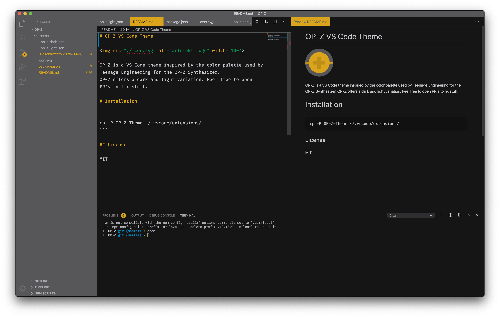
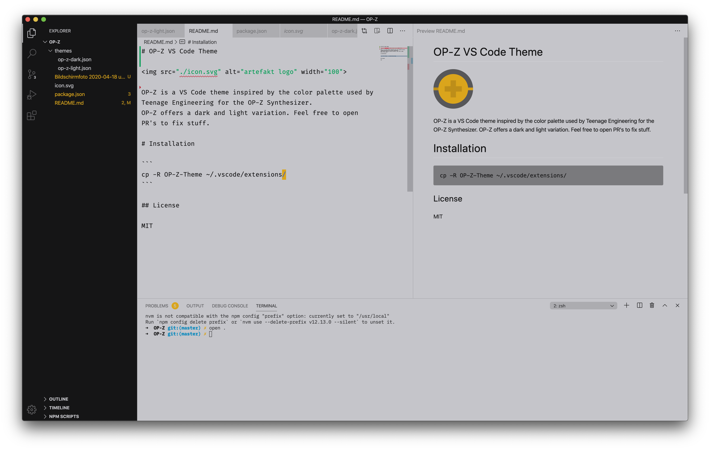

# OP-Z VS Code Theme


OP-Z is a VS Code theme inspired by the color palette used by Teenage Engineering for the [OP-Z Synthesizer](https://teenage.engineering/products/op-z).
OP-Z offers a dark and light variation. Feel free to open PR's to fix stuff.

## Dark



## Light



# Installation

```
$ cp -R OP-Z-Theme ~/.vscode/extensions/
```

Some settings I use with the theme.

```
  "workbench.iconTheme": null,
  "workbench.colorTheme": "OP-Z Dark",
  "diffEditor.ignoreTrimWhitespace": true,
  "editor.renderWhitespace": "none",
  "editor.renderIndentGuides": false,
  "editor.renderLineHighlight": "none",
  "editor.overviewRulerBorder": false,
  "editor.hideCursorInOverviewRuler": true,
  "editor.folding": false,
  "editor.occurrencesHighlight": false,
  "editor.matchBrackets": "always",
  "editor.glyphMargin": false,
  "explorer.openEditors.visible": 0,
  "workbench.editor.tabCloseButton": "off",
  "workbench.statusBar.visible": false,
```

## License

MIT
